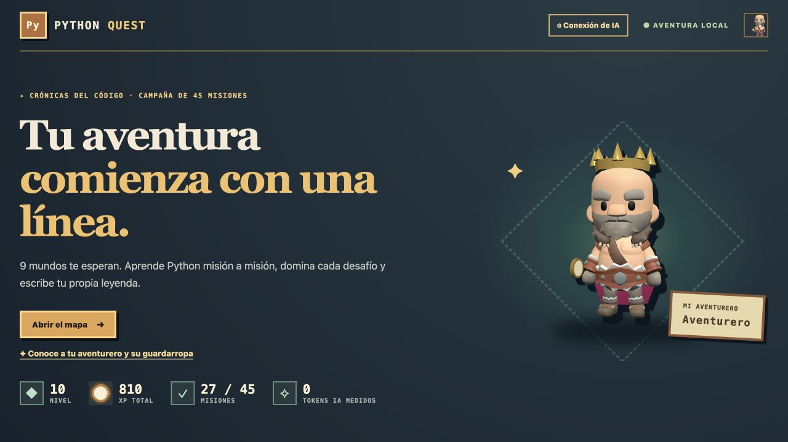
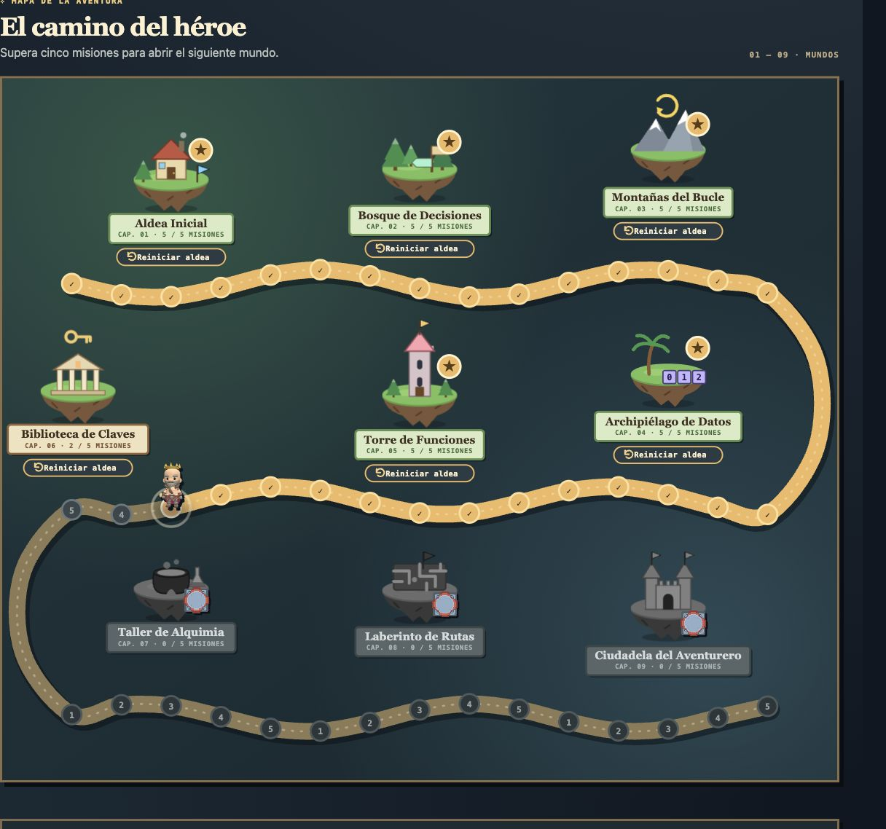
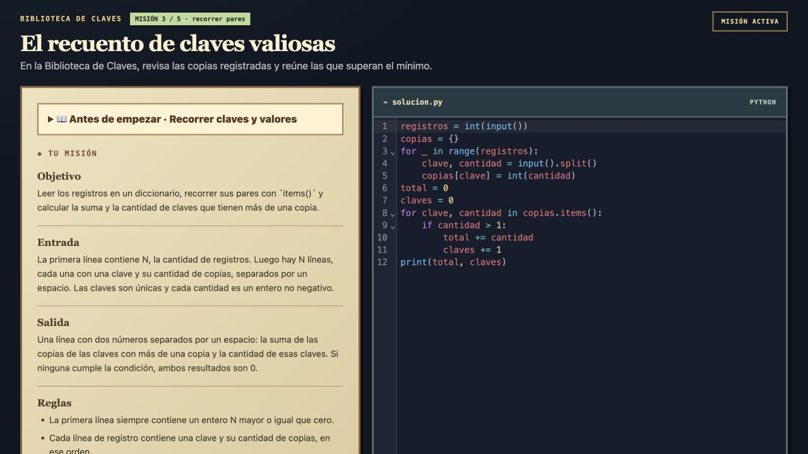
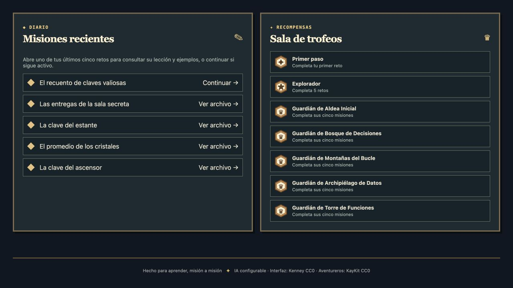

# Python Quest

Aplicación local para practicar Python mediante una aventura de 45 misiones. La IA crea ejercicios según el nivel y los errores anteriores del alumno, y explica los resultados de sus intentos.



## Qué demuestra

- **IA con contexto:** recibe la etapa del currículo, las misiones anteriores, las dificultades recientes y las preferencias del alumno.
- **Evaluación verificable:** cada misión incluye dos ejemplos públicos, cuatro casos adicionales y una solución de referencia que debe pasar las pruebas antes de aceptar el ejercicio.
- **Retroalimentación guiada:** las pruebas automáticas deciden si la solución pasa; la IA explica el fallo sin entregar la solución completa. Si el proveedor falla durante la revisión, la aplicación muestra el resultado de las pruebas.
- **Progresión:** nueve mundos, lecciones por etapa, XP, monedas, trofeos y un guardarropa con personajes 3D.
- **Elección de proveedor:** conexiones por CLI o API, con las claves API almacenadas en el llavero del sistema.

Pensado para practicar desde fundamentos hasta estructuras de datos, funciones y pequeños problemas integradores.

## Capturas

| Mapa y progresión | Editor y ejercicio |
| --- | --- |
|  |  |



Las capturas muestran una sesión de demostración. El código visible se escribió para ilustrar el uso del editor.

## Cómo se integra la IA

1. El currículo define el objetivo, las herramientas permitidas y los casos límite de cada etapa.
2. La IA devuelve un ejercicio en JSON con enunciado, pista, pruebas y solución de referencia.
3. La aplicación comprueba las construcciones de Python, ejecuta la referencia contra las pruebas y verifica que el reto aporte una operación o decisión nueva. Puede rechazar y reintentar una generación inconsistente.
4. El alumno escribe su programa. «Ejecutar» permite probarlo sin IA; «Enviar solución» ejecuta las seis pruebas y pide una explicación al proveedor.
5. El resultado actualiza el progreso y las dificultades que recibirá la siguiente misión.

Las comprobaciones detectan inconsistencias, pero no garantizan que todo enunciado generado sea correcto: la IA también puede equivocarse.

## Requisitos

- Python 3.10 o superior
- Node.js y npm solo para modificar el editor web
- Una conexión de IA: Codex CLI, Claude CLI, OpenCode CLI, OpenAI API, Anthropic API, Ollama Cloud, OpenRouter o una API HTTPS compatible con OpenAI.
- Un llavero del sistema disponible si utilizas una clave API (en Linux suele requerir Secret Service).

**Uso local y personal:** el ejecutor permite las herramientas de Python del curso, pero no sustituye un entorno aislado del sistema operativo. No lo expongas como servicio público ni multiusuario; consulta [los límites de seguridad](#seguridad-y-datos).

## Iniciar

### 1. Descargar el proyecto

```sh
git clone https://github.com/DiegoVill15/Python-Quest.git
cd Python-Quest
```

También puedes descargar el ZIP del repositorio y abrir una terminal en la carpeta extraída.

### 2. Instalar y ejecutar

**macOS y Linux**

```sh
python3 -m venv .venv
.venv/bin/pip install -r requirements.txt
.venv/bin/python app.py
```

**Windows (PowerShell)**

```powershell
py -3 -m venv .venv
.\.venv\Scripts\pip.exe install -r requirements.txt
.\.venv\Scripts\python.exe app.py
```

Usa Python 3.10 o superior. Node.js solo es necesario para modificar la interfaz o ejecutar sus pruebas; el repositorio incluye la versión compilada.

### 3. Abrir la aplicación

Visita <http://127.0.0.1:5001> en tu navegador. Mantén abierta la terminal mientras usas Python Quest.

### 4. Conectar la IA

Abre **«Conexión de IA»** y elige una de estas opciones:

| Tipo de conexión | Qué necesitas |
| --- | --- |
| Codex, Claude u OpenCode por CLI | Instalar la CLI elegida e iniciar sesión en ella. |
| OpenAI, Anthropic, Ollama Cloud u OpenRouter por API | Una clave del proveedor y un llavero del sistema disponible. |
| API compatible con OpenAI | Una dirección HTTPS pública y una clave API. |

Selecciona un modelo y pulsa **«Usar este modelo»**. Si no se puede cargar la lista, utiliza **«Escribir ID manualmente…»**.

Las claves API se guardan en el llavero del sistema. La creación y revisión de misiones utilizan el proveedor seleccionado y pueden consumir uso o créditos de tu cuenta.

## Cómo jugar

### Resolver una misión

1. Abre el mapa y selecciona la misión disponible.
2. Lee la lección, el objetivo, la entrada, la salida y los ejemplos.
3. Escribe tu programa en el editor, que empieza vacío.
4. Usa **«Ejecutar»** para probarlo con una entrada propia o un ejemplo público.
5. Pulsa **«Enviar solución»** para comprobar las seis pruebas y recibir una explicación.

«Ejecutar» no usa IA ni cambia el progreso. Los errores de sintaxis también se muestran sin consultar al proveedor.

### Avanzar y personalizar tu aventurero

- La campaña contiene nueve mundos de cinco misiones. Cada mundo se desbloquea al completar el anterior.
- Cada misión superada por primera vez entrega 30 XP y 10 monedas.
- En el guardarropa puedes cambiar el nombre y aspecto del aventurero, probar objetos en 3D, comprarlos y equiparlos.
- Puedes reiniciar un mundo para practicar de nuevo. Conservas las recompensas y los mundos desbloqueados; una etapa ya premiada no vuelve a entregar XP ni monedas.

### Consultar misiones y adaptar los próximos retos

- **Misiones recientes:** muestra los últimos cinco retos creados. «Continuar» recupera una misión activa; «Ver archivo» abre la lección, el enunciado y los ejemplos de un reto anterior.
- **Preferencias:** puedes indicar qué explicaciones o ejemplos te ayudan. La IA recibe estas preferencias y las dificultades recientes al crear la siguiente misión.
- **Borradores:** el código de la misión activa se guarda en ese navegador. Para retomarlo, utiliza el mismo navegador y perfil.

## Modificar la interfaz

El editor CodeMirror y las imágenes de Kenney se sirven desde `static/`, sin depender de una CDN. Después de cambiar `static/app.js`, reconstruye el archivo servido por Flask:

```sh
npm ci
npm run build
```

Los recursos de `static/assets/kenney/` son de [Kenney UI Pack Pixel Adventure](https://kenney.nl/assets/ui-pack-pixel-adventure), licencia CC0. Los personajes 3D y el bastón de `static/assets/kaykit/` proceden de la versión gratuita 2.0 de [KayKit Adventurers](https://kaylousberg.itch.io/kaykit-adventurers), también CC0. Las demás piezas visuales del guardarropa son adaptaciones propias.

## Seguridad y datos

Esta versión ejecuta código escrito por el usuario y una solución de referencia creada por la IA. Ambos pasan por la misma validación y se ejecutan con un conjunto reducido de funciones incorporadas. Se permiten las herramientas del curso: entrada y salida, cálculos, decisiones, bucles, colecciones y funciones propias. Las importaciones, el acceso a archivos, la creación de procesos y la inspección interna de objetos están bloqueados.

Cada ejecución tiene límites de tiempo y salida; en Linux también se limita la memoria del proceso. Estas restricciones no equivalen a aislar el intérprete mediante el sistema operativo. Permite acceso solo a tus dispositivos de confianza; no la publiques en Internet ni como servicio multiusuario.

Las conexiones API utilizan HTTPS con verificación de certificados, direcciones públicas comprobadas al conectar y sin redirecciones. No utilizan proxies configurados mediante variables de entorno. Las respuestas HTTP y de las CLI tienen un máximo de 2 MiB y un tiempo de espera; la aplicación rechaza misiones cuyos campos no respetan el formato esperado.

El contexto del ejercicio y el código enviado para revisión se comparten con el proveedor de IA seleccionado. No incluyas contraseñas ni datos sensibles en el editor o en tus comentarios.

- **Progreso:** se guarda en `data/state.json`, en el equipo que ejecuta la aplicación.
- **Borradores:** se guardan en el navegador y no se sincronizan entre dispositivos.
- **Claves API:** permanecen en el llavero del sistema.
- **Archivos locales:** `data/`, el entorno de Python, las dependencias instaladas, los registros y los archivos `.env` están excluidos del repositorio.

### Acceso desde otros dispositivos

Puedes usar Python Quest desde otro ordenador, una tablet o un teléfono mediante **Tailscale Serve**. El equipo que ejecuta Python Quest debe permanecer encendido, con la aplicación abierta.

#### 1. Conectar tus dispositivos

Instala [Tailscale](https://tailscale.com/download) en el equipo servidor y en los dispositivos desde los que quieras entrar. Conéctalos a la misma red privada de Tailscale y permite acceso al servidor solo a dispositivos y personas de confianza.

#### 2. Compartir la aplicación dentro de tu red privada

Inicia Python Quest como se explica arriba. En otra terminal del equipo servidor, ejecuta:

```sh
tailscale serve --bg --tcp=5000 tcp://127.0.0.1:5001
tailscale ip -4
tailscale serve status
```

La aplicación sigue escuchando en `127.0.0.1:5001`; Tailscale permite acceder a ella por el puerto `5000` dentro de tu red privada. `--bg` mantiene esta configuración activa en segundo plano.

#### 3. Abrir desde otro dispositivo

Con Tailscale conectado, abre en su navegador:

```text
http://<IP-Tailscale-del-servidor>:5000
```

Sustituye el marcador por la dirección que mostró `tailscale ip -4`. Si tienes MagicDNS habilitado, también puedes utilizar el nombre del servidor en lugar de su IP.

El progreso y la conexión de IA pertenecen al servidor. Los borradores del editor se guardan por separado en cada navegador.

#### 4. Desactivar el acceso

En el equipo servidor, ejecuta:

```sh
tailscale serve --bg --tcp=5000 off
```

Este acceso es opcional. Python Quest no tiene inicio de sesión propio: quien tenga acceso puede ejecutar programas admitidos por el curso, cambiar el progreso y utilizar la conexión de IA del servidor. Usa **Serve** para tu red privada; no actives Funnel para publicarla en Internet. Consulta la [documentación de Tailscale Serve](https://tailscale.com/docs/reference/tailscale-cli/serve).

## Pruebas

Las pruebas comprueban la generación y evaluación de ejercicios, el progreso, las recompensas, las conexiones de IA y dos interacciones de la interfaz. Usan respuestas simuladas de los proveedores: no necesitan claves API ni consumen créditos de IA.

### Python

Con las dependencias instaladas, ejecuta:

```sh
# macOS y Linux
.venv/bin/python -m unittest discover -s tests
```

```powershell
# Windows
.\.venv\Scripts\python.exe -m unittest discover -s tests
```

### Interfaz

Necesitas Node.js y npm:

```sh
npm ci
npm test
```

### Comprobaciones en GitHub

El archivo `.github/workflows/tests.yml` configura GitHub Actions para ejecutar las mismas pruebas en un entorno limpio con cada push o pull request. También reconstruye la interfaz y comprueba que el archivo compilado coincida con el código fuente.

Su función es detectar fallos antes de incorporar cambios. Este flujo no publica la aplicación ni se conecta a un proveedor de IA.

## Estructura

- `app.py`: servidor Flask y rutas de la aplicación.
- `quest/curriculum.py`: currículo y lecciones de las 45 etapas.
- `quest/codex_teacher.py` y `quest/schemas/`: instrucciones y formatos JSON para la IA.
- `quest/providers.py`: conexiones, modelos, claves y uso reportado por el proveedor.
- `quest/service.py`, `quest/grader.py` y `quest/store.py`: validación, ejecución, progreso y persistencia.
- `static/` y `templates/`: interfaz con CodeMirror y personajes con Three.js.
- `tests/`: comprobaciones del currículo, la evaluación, las conexiones, el progreso y la navegación.

## Licencia

El código del proyecto se distribuye bajo la [licencia MIT](LICENSE), a nombre de Diego Villalobos. Los recursos de Kenney y KayKit conservan sus licencias CC0 y sus avisos en `static/assets/`. Las dependencias conservan sus propias licencias.
